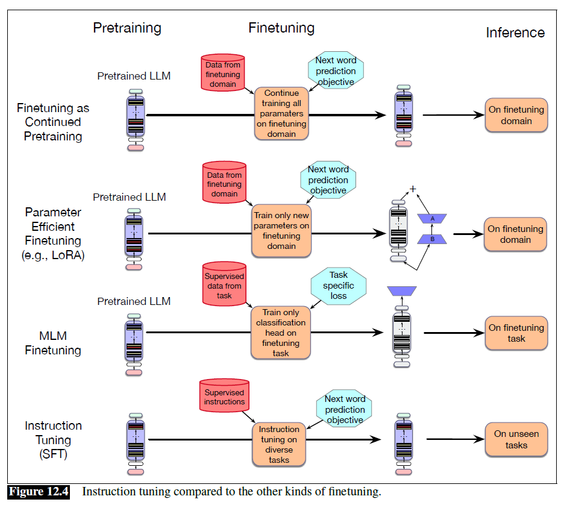
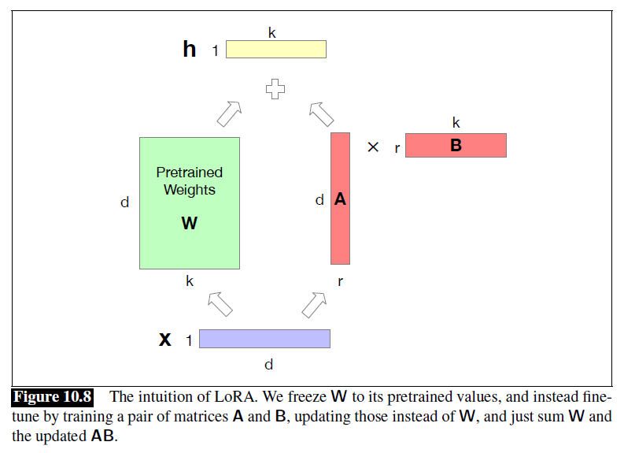

# Fine-tuning

## Different types of fine-tuning

### Continued Pre-training

- Retrain all the parameters on the new data, using the same method (word prediction) and loss function (cross-entropy loss) as for pretraining
- In a sense it's as if the new data were at the tail end of the pretraining data
- Retraining all the parameters of the model is very slow and expensive when the language model is huge

### Parameter-efficient Finetuning (PEFT)

- Freeze some of the parameters and train only a subset of parameters on the new data
- e.g. LoRA

### MLM Finetunig

- Add an extra head
- Commonly used with masked language models like BERT
- Freeze the entire pretrained model and only train the classification head on some new data, usually labeled with some class that we want to predict

### Supervised Finetuning (SFT)

- Often used for **instruction tuning**, in which we want a pretrained language model to learn to follow text instructions
- Create a dataset of prompts and desired responses, and train the language model using the normal cross-entropy loss to predict each token in the instruction prompt iteratively, essentially training it to produce the desired response from the command in the prompt

## Concepts

### Model Alignment

- Together we refer to instruction tuning and preference alignment as model alignment
- The intuition is that we weant the learning objectives of models to be aligned with the goals of the humans that use them

#### Instruction Tuning

- A technique that helps LLMs learn to correctly respond to instructions by taking a base pretrained LLM, and finetuning them on a corpus of instructions with their corresponding response
- To train the LLM to follow instructions for a range of tasks
- The resulting model not only learns those tasks, but also engages in a form of meta-learning: it improves its ability to follow instructions generally
- Sometimes called SFT for supervised finetuning
- Even though it is trained to predict the next token (which we traditionally think of as self-supervised), we call this method SFT because unlike in pretraining, each instruction or question in the instruction tuning data has a supervised objective: a correct answer to the question or a response to the instruction

**How to create instruction tuning datasets?**

1. For people to write the instances directly
   - time consuming and costly
2. Make use of the copious amounts of supervised training data that have been curated over the years for a wide range of natural language tasks
   - To generate instruction-tuning data, these fields and the ground-truth labels are extracted from the training data, encoded as key/value pairs, and inserted in templates to produce instantiated instruction
3. Crowdsourcing based on carefully written annotation guidelines, which can include detailed step-by-step instructions, pitfalls to avoid, formatting instructions, length limits, exemplars, etc.
4. Use language models

**Evaluation of Instruction-Tuned Models:**

- Take a leave-one-out approach: instruction-tune a model on some large set of tasks and then assess it on a withheld task
  - But the enormous numbers of tasks in instruction-tuning datasets (e.g. 1600 for Super Natural Instructions) often overlap
- Large instruction-tuning datasets are partitioned into clusters based on task similarity, the leave-one-out training/test approach is then applied at the cluster level
  - i.e. to evaluate a model's performance on sentiment analysis, all the sentiment analysis datasets are removed from the training set and reserved for testing

#### Preference Alignment

- A separate model is trained to decide how much a candidate response aligns with human preferences
- e.g. RLHF, DPO

## Models

### Low-Rank Adaptation (LoRA)

- Freeze layers $\textbf{W}^Q$, $\textbf{W}^K$, $\textbf{W}^V$, $\textbf{W}^O$ during finetuning, and instead update a low-rank approximation that has fewer parameters
- Replace $\textbf{W} + \Delta \textbf{W}$ with $\textbf{W} + \textbf{AB}$
- **Forward pass:** $\textbf{h} = \textbf{xW} + \textbf{xAB}$
- Dramatically reduces hardware requirements, since gradients don't have to be calculated for most parameters
- The weight updates can be simply added into the pretrained weights
- Since $\textbf{AB}$ is the same size as $\textbf{W}$, it doesn't add any time during inference

### Reinforcement Learning with Human Feedback (RLHF)

### Direct Preference Optimization (DPO)
