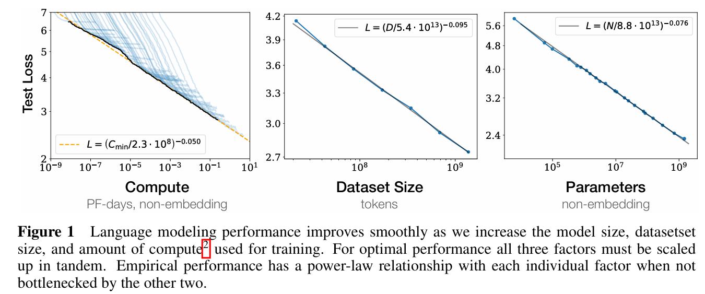

# Large Language Models

Refer to the LLM Bootcamp

## Concepts

### Language Models (LMs)

- The models that assign a probability to each possible next word
- LMs can also assign a probability to an entire sequence

### Representation vs Generative

1. **Representation Language Models**
   - Do not generate text but are commonly used for task-specific use cases
   - e.g. Classification
2. **Generative Language Models**
   - LLMs that generate text
   - e.g. GPT models

### Causal / Autoregressive Language Models

- Iteratively predict words left-to-right from earlier words
- Conditional generation

### Top-$k$ Sampling

- Simple generalizatoin of greedy decoding
- When $k=1$, identical to greedy decoding

**Steps:**

1. Choose in advance a number of words $k$
2. For each word in vocabulary $V$, use the language model to compute the likelihood of this word given the context $p(w_t | \textbf{w}_{<t>})$
3. Sort the words by their likelihood, and throw away any word that is not one of the top $k$ most probable words
4. Renormalize the scores of the $k$ words to be a legitimate probability distribution
5. Randomly sample a word from within these remaining $k$ most-probable words according to its probability

### Nucleus or Top-$p$ Sampling

- To keep not the top $k$ words, but the top $p$ percent of the probability mass
- The hope is that the measure will be more robust in very different contexts, dynamically increasing and decreasing the pool of word candidates

Given a distribution $P(w_{t} | \textbf{w}_{<t})$, the top-$p$ vocabulary $V^{(p)}$ is the smallest set of words such that:

$$\sum_{w \in V^{(p)}}{P(w_{t} | \textbf{w}_{<t}) \geq p}$$

### Temperature Sampling

$$\textbf{y} = \text{softmax}(u / \tau)$$

- Don't truncate the distribution, but instead reshape it
- **The intuition comes from thermodynamics:**
  - A system at a high temperature is very flexible and can explore many possible states
  - A system at a lower temperature is likely to explore a subset of lower energy (better) states
- In low-temperature sampling, we smoothly increase the probability of the most probable words and decrease the probability of the rare words
  - The lower $\tau$ is, the larger the scores being passed to the softmax
  - Softmax tends to push high values toward 1 and low values toward 0
- Divide the logit by a temperature parameter $\tau$
  - **Low-temperature sampling:** $\tau \in (0,1]$, making the distribution more greedy
  - **High-temperature sampling:** $\tau > 1$, flatten the distribution

### Pretraining

#### Self-supervised Training Algorithm

- **Cross-entropy loss:** the negative log probability the model assigns to the next word in the training sequence
  - $L_{CE}(\hat{\textbf{y}}_t, \textbf{y}_t) = - \log{\textbf{y}_t [w_{t+1}]}$
- **Teacher forcing:** always give the model the corrext history sequence to predict the next word

- At each step, given all the preceding words, the final transformer layer produces an output distribution over the entire vocabulary
- During trianing, the probabiliy assigned to the correct word is used to calculate the cross-entropy loss for each item in the sequence
- The loss for a training sequence is the average cross-entropy loss over the entire sequence

#### Training Corpora

- Mainly trained on text scraped from the web, augmented by more carefully curated data
  - e.g. Common Crawl, The Pile
- Likely to contain many natural examples
  - e.g. question-answer pairs (e.g. from FAQ lists), translations of sentences between various languages, documents together with their summaries

#### Filtering for quality and safety

- Pretraining data drawn from the web is filtered for both quality and safety
- **Quality filtering:**
  - Subjective, different quality filters are trained in different ways, but often to value high-quality reference corpora like Wikipedia, books, and particular websites
  - To avoid websites with lots of PII (Personal Identifiable Information) or adult content
  - Removes boilerplate text
  - Deduplication, various levels: remove duplicate documents, duplicate web pages, or duplicate text
- **Safety filtering:**
  - Subjective
  - Often includes toxicity detection

### Evaluation

#### Perplexity

$$\text{Perplexity}_{\theta}(w_{1:n}) = \sqrt[n]{\prod_{i=1}^{n}{\frac{1}{P_{\theta}(w_i | w_{<i})}}}$$

- Because perplexity depends on the length of a text, it is very sensitive to differences in the tokenization algorithm
- Hard to exactly compare perplexities produced by two language models if they have very different tokenizers
- Perplexity is best used when comparing language models that use the same tokenizer

#### Other factors

- **Task-specific metrics** that allow us to evaluate how accuracy or correct language models are at the downstream tasks
- **How big** a model is, and **how long** it takes to train or do inference
- Constraints on **memory**, since the GPUs have fixed memory sizes
- Measuring performance normalized to a giving compute or memory budget, or directly measure the **energy usage** of the model in kWh or in kilograms of $\text{CO}_2$ emitted
- **Fairness**: because language models are biased
- **Leaderboard**: e.g. Dynabench, HELM

### Scale

The performance of LLMs are mainly determined by 3 factors:

1. **Model Size:**
   - The number of parameters not counting embeddings
   - Improve a model by adding parameters (adding more layers or having wider contexts or both)
2. **Dataset Size:**
   - The amount of training data
   - Improve a model by adding more training data
3. **Amount of Compute Used for Training:**
   - Improve a model bt training for more iterations

#### Scaling Laws

- Loss $L$ as a function ofthe number of non-embedding parameters $N$, the dataset size $D$, and the compute budget $C$:
- The constants depend on the exact transformer architecture, tokenization, and vocabulary size, so rather than all the precise values, scaling laws focus on the relationship with loss

### KV Cache

- The attention vector can be very efficiently computed in parallel for training
- Not the case during inference, because we iteratively generate the next tokens one at a time. For a new token just generated, call it $\textbf{x}_i$, we need to compute its query, key, values by multiplying by $\textbf{W}^Q$, $\textbf{W}^K$, $\textbf{W}^V$, respectively
- But a waste of computation time to recompute the key and value vectors for all the prior tokens $\textbf{x}_{<i}$
- Instead of recomputing, whenever we compute the key and value vectors we store them in memory in the KV cache, and then we can just grab them from the cache when we need them

## Models

- GPT Family
- BERT Family
- PaLM Family
- LLaMA Family
- Claude Family
- Mistral?
- Tsinghua?