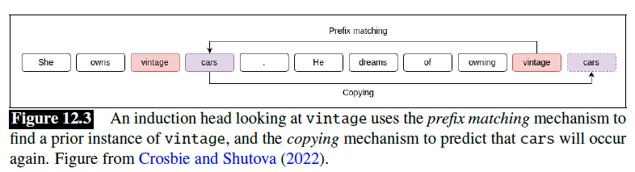

# Prompt Engineering

- https://www.developer.tech.gov.sg/products/collections/data-science-and-artificial-intelligence/playbooks/prompt-engineering-playbook-beta-v3.pdf
- https://www.promptingguide.ai/

## Concepts

### Prompt

- A text string that a user issues to a language model to get the model to do something useful
- In prompting, the user's prompt string is passed to the language model, which iteratively generates tokens conditioned on the prompt

We prompt an LM by transforming each task into a form that is amenable to contextual generation by an LLM:

1. For a given task, develop a task-specific template that has a free parameter for the input text
2. Given that input and the task-specific template, the input is used to instantiate a filled prompt that is then passed to a pretrained language model
3. Autoregressive decoding is then used to generate a sequence of token outputs
4. The output of the model can either be used directly as the desired output (as in the case of naturally generative tasks such as translation or summarization), or a task-appropriate answer can be extracted from the generated output (as in the case of classification)

### Few-shot Prompting

- Include some demonstrations in the prompt template

#### How Many Demonstrations?

- A small number of randomly selected labeled examples used as demonstrations can be sufficient to improve performance over the zero-shot setting
- The largest performace gains in few-shot prompting tends to come from the first demonstration, with diminishing returns for subsequent demonstrations
- Why isn’t it useful to have more demonstrations? The reason is that the primary benefit in examples is to demonstrate the task to be performed to the LLM and the format of the sequence, not to provide relevant information as to the right answer
- Demonstrations that have incorrect answers can still improve a system
- Adding too many examples seems to cause the model to overfit to details of the exact examples chosen and generalize poorly

#### How to Select Demonstrations?

- Demonstrations are generally created by formatting examples drawn from a labeled training set
- Some heuristics about what makes a good demonstration: using demonstrations that are similar to the current input seems to improve performance
- More generally, the best way to select demonstrations from the training set is programmatically: choosing the set of demonstrations that most increases task
performance of the prompt on a test set
- Systems like DSPy, a framework for algorithmically optimizing LM prompts, can automatically find the optimum set of demonstrations to include by searching through the space of possible demonstrations to include

### In-context Learning

- Prompting as in-context learning: learning that improves model performance or reduces some loss but does not involve gradient-based updates to the model's underlying parameters
- We don't know how in-context learning works, but there are some hypotheses

#### Induction Heads

- The function of the induction head is to predict repeated sequences
- If it sees the pattern $AB ... A$ in an input sequence, it predicts that $B$ will follow, instatiating the pattern completion rule $AB ... A \rightarrow B$
- A generalized fuzzy version: $A^* B^* ... A \rightarrow B^*$, where $A^* \approx A$ and $B^* \approx B$, might be responsible for in-context learning
- Suggestive evidence show that ablating induction heads causes in-context learning performance to decrease

### Chain-of-Thought (CoT)

- Each of the demonstrations in the few-shot prompt is augmented with some text explaining some reasoning steps
- The goal is t cause the language model to output similar kinds of reasoning steps for the problem being solved, and for the output of those reasoning steps to cause the system to generate the correct answer

### Automatic Prompt Optimization

- Given a prompt for a task (human or computer generated), prompt optimization methods search for prompts with improved performance
- Can be viewed as a form of iterative improvement search through a space of possible prompts for those that optimize performance on a task
- **Components:**
  - **A start state:** an intial human or machine generated prompt or prompts suitable for some task
  - **A scoring metric:** a method for assessingn how well a given prompt performs on the task
  - **An expansion method:** a method for generating variations of a prompt
- Beam search

#### Candidate Scoring

- Assess the likely performance of potential prompts, both to identify promising avenues of seach and to prune those that are unlikely to be effective
- Given access to labeled training data, candidate prompts can be scored based on execution accuracy
  - Candidate prompts are combined with inputs sampled from the training data and passed to an LLM for decoding
  - The LLM output is evaluated againts training label using a metric appropirate for the task
- Evaluating each candidate prompt against a complete training set would be infeasible
- Instead, prompt performance is estimated from a small sample of training data

#### Prompt Expansion

- Generates variants of a given prompt to create an expanded set of neighboring prompts that improve performance over the original

**Methods:**

1. Use language models to create paraphrases for the prompt
2. Truncate the current prompt as a set of random locations, generating a set of prompt prefixes, the paraphrasing LLM is then asked to continue each of the prefixes to generate a complete prompt
   - Uninformed search: the candidate expansion step is not directed towards generating better candidates; candidates are generated without regard to their quality. It it is the job of the priority queue to elevate improved candidates when they are found
3. Attempts to generate superior prompts:
   1. Run the prompt on a sample of training examples
   2. Identify examples where the prompt fails
   3. Ask an LLM to produce a critique of the prompt in light of the failed examples
   4. Provide the resulting critique to an LLM, and ask it to generate improved prompts

### Evaulate Prompted Language Models