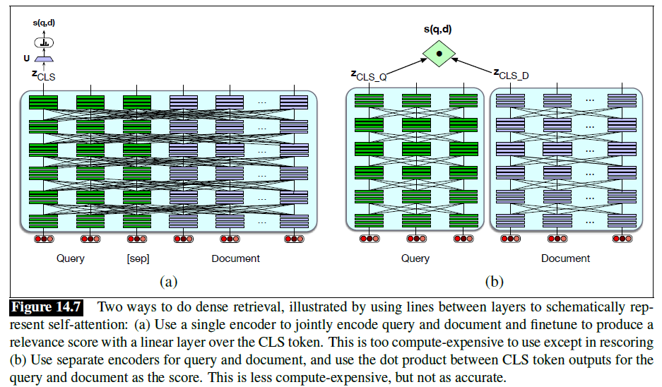

# Retrieval Augmented Generation

## Concepts

### Factoid Questions

- Questions of fact or reasoning that can be answered with simple facts expressed in short or medium-length texts

### Information Retrieval (IR)

- The task of finding the document $d$ from the $D$ documents in some collection that best matches a query $q$
- The resulting IR system is often called a search engine
- Represent the document and query with length $|V|$
- Compare two vectors to find how similar they are
- In modern IR systems, the use of stop lists is much less common, partly due to improved efficiency and partly because much of their function is already handled by IDF weighting, which downweights function words that occur in every document

#### Ad-hoc Retrieval

- An example of the bag-of-words model, since words are considered independently of their positions
- A user poses a query to a retrieval system, which then returns an ordered set of documents from some collection
- Uses the vector space model, in which we map queries and document to vectors based on unigram word counts
- Uses the cosine similarity between the vectors to rank potential documents

#### Document

- Whatever unit of text the system indexes and retrieves (web pages, scientific papers, news articles, or even shorter passages like paragraphs)

#### Collection

- A set of documents being used to satisfy user requests

#### Term

- A word in a collection, but it may also include phrases

#### Query

- A user's information need expressed as a set of terms

### Term Weighting

- We don't use raw word counts in IR, instead computing a term weight for each word
- e.g. TF-IDF, BM25 (slightly powerful variant)
- Conceptual flaw: they work only if there is exact overlap of words between the query and the document

### Document Scoring

- Used for ranking documents based on their similarity to a query

We score document $d$ by the cosine of its vector $\textbf{d}$ with the query vector $\textbf{q}$:

$$\text{score}(q, d) = \cos{(\textbf{q}, \textbf{d})} = \frac{\textbf{q} \cdot \textbf{d}}{|\textbf{q}| \cdot |\textbf{d}|} = \sum_{t \in \textbf{q}}{\frac{\text{tf-idf}(t, q)}{\sqrt{\sum_{q_i \in q}{\text{tf-idf}^2(q_i, q)}}} \cdot \frac{\text{tf-idf}(t, d)}{\sqrt{\sum_{d_i \in d}{\text{tf-idf}^2(d_i, d)}}}}$$

### Inverted Index

- The basic search problem in IR is to find all documents $d \in C$ that contain a term $q \in Q$
- An inverted index, given a query term, gives a list of documents that contain the term
- It consists of two parts:
  - **Dictionary:** a list of terms, each poiting to a postings list for term; can also store the document frequency for each term
  - **Postings:** a postings list is the list of document IDs associated with each term, which can also contain information like the term frequency or even the exact positions of
terms in the document
- Given a list of terms in query, we can very efficiently get lists of all candidate documents, together with the information necessary to compute the tf-idf scores we need

### IR with Dense Vectors

- To handle the **vocabulary mismatch problem**: the user posing a query needs to guess exactly what words the writer of the answer might have used
- An approach that can handle synonymy: instead of (sparse) word-count vectors, using (dense) embeddings
- Supervised algorithms (e.g. ColBERT) need training data in the form of queries together with relevant and irrelevant passages or documents
- If datasets don’t have labeled positive examples, **Relevance-Guided Supervision** can be used

#### BERT

#### ColBERT

- For each token in $q$, ColBERT finds the most contextually similar token in $d$, and then sums up these similarities

### Nearest Neighbor Search

- Every possible document must be ranked for its similarity to the query:
  - **Sparse word-count vector:** inverted index
  - **Dense vector:** nearest neighbor search, e.g. Faiss

### Evaluation of IR Systems

#### Precision and Recall

- Assume that each document returned by the IR system is either relevant or not
- **Precision:** the fraction of returned documents that are relevant
- **Recall:** the fraction of relevant documents that are returned
- Don't adequately measure the performance of a system that ranks the documents it returns

#### Interpolated Precision

- Let us average performance over a set of queries
- Also helps smooth over the irregular precision values

#### Mean Average Precision (MAP)

**Average Precision (AP) for a single query:**

$$\text{AP} = \frac{1}{|R_r|} \sum_{d \in R_r}{\text{Precision}_r (d)}$$

- $R_r$: the set of relevant documents at or above $r$
- $\text{Precision}_r (d)$: the precision measured at the rank at which document $d$ is found

**For an ensemble of queries $Q$:**

$$\text{MAP} = \frac{1}{|Q|} \sum_{q \in Q}{\text{AP}(q)}$$

### RAG

- Address hallucination (unable to show textual evidence to support the answer), and the problem of unable to answer questions from proprietary data
- Condition on the retrieved passages as part of the prefix
- As with the span-based extraction reader, successfully applying the retrievalaugmented generation algorithm for QA requires a successful retriever, and often a two-stage retrieval algorithm is used in which the retrieval is reranked
- Some multihop complex questions may require multi-hop architectures, in which a query is used to retrieve documents, which are then appended to the original query for a second stage of retrieval
- Details of prompt engineering also have to be worked out, like decising whether to demarcate passages

$$p(x_1, ..., x_n) = \prod_{i=1}^{n}{p(x_i | R(q); ~ \text{prompt}; ~ \text{[Q:]}; q; ~ \text{[A:]}; ~ x_{<i})}$$

### Question Answering Datasets

- Scores of QA datasets, used both for instruction tuning and for evaluation of the QA abilities of language models
- **Dimensions:**
  - **Questions:** natural, probing
  - **Answers:** multiple-choice, free form
  - **Prompting**: zero-shot (just the question), few-shot (given demos of answers to similar questions)

#### Natural information-seeking questions

- e.g. Natural Questions, MS MARCO, DuReader, TyDi QA
- **Open book QA task:** Question answering given one or more documents, e.g. RAG
- **Closed book QA task:** Answering directly from the LM with no retrieval component

#### Questions designed for probing

- **Probing:** evaluating or testing systems or humans
- e.g. MMLU

### Evaluation of QA

#### Exact match

- For multiple-choice questions like in MMLU
- The percentage of predicted answers that match the true answer exactly

#### $F_1$ score

- For questions with free text answers, like Natural Questions
- The average token overlap between predicted and true answers
- Treat the prediction and true answer as a bag of tokens, and compute the $F_1$ score for each question
- Then return the average $F_1$ score across all questions

#### Mean Reciprocal Rank (MRR)

- For QA systems who return multiple ranked answers
- Each test question is scored with the reciprocal of the rank of the first correct answer

$$\text{MRR} = \frac{1}{|Q|} \sum_{i=1}^{|Q|}{\frac{1}{rank_i}}$$

## Models

### Best Match 25 (BM25)

- Sometimes called Okapi BM25, after the Okapi IR system
- Adds two parameters:
  - $k$: adjust the balance between tf and idf
  - $b$: controls the important of document length normalization
- $|d_{\text{avg}}|$: the average document length in the collection

The BM25 score for a query $q$ and document $d$ is:

$$\text{score}(q, d) = \sum_{t \in q}{\log{\left(\frac{N}{df_t}\right)} \cdot \frac{tf_{t, d}}{k(1 - b + b \cdot \frac{|d|}{|d_{\text{avg}}|}) + tf_{t,d}}}$$

- When $k = 0$, BM25 reverts to no use of term frequency, just a binary selection of terms in the query (plus idf)
- A large $k$ results in raw term frequency (plus idf)
- $b$ ranges from 1 (scaling by document length) to 0 (no length scaling)

### RAG Indexing

### RAG Retrieval

### RAG Generation

### RAG Routing

### RAG Query Translation

### RAG Query Construction